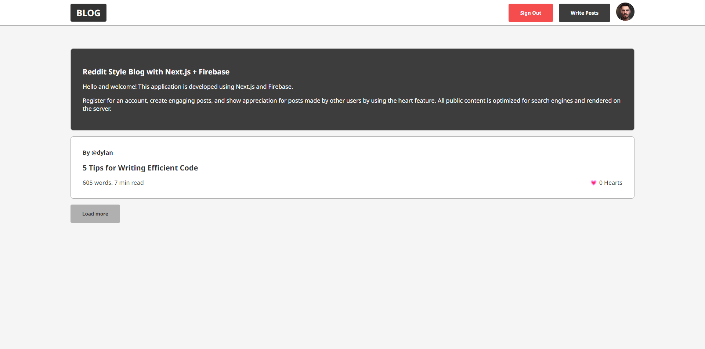

# This is a [Next.js](https://nextjs.org/) project bootstrapped with [`create-next-app`](https://github.com/vercel/next.js/tree/canary/packages/create-next-app).

# Features
* real-time storage and image upload
* markdown support with the live preview
* likes/dislikes functionality
* context API for the global state
* create, read, and edit posts
* most of the content is generated on the server using Next
* user auth with the Google Firebase



## Getting Started
* Create your own next-config.js with [firebase]('https://firebase.google.com/') env variables in the root of the project:

```typescript
/** @type {import('next').NextConfig} */
const nextConfig = {
  reactStrictMode: true,
  env: {
    REACT_APP_API_KEY: "",
    REACT_APP_AUTH_DOMAIN: "",
    REACT_APP_PROJECT_ID: "",
    REACT_APP_STORAGE_BUCKET: "",
    REACT_APP_MESSAGING_SENDER_ID: "",
    REACT_APP_APP_ID: "",
  },
};

module.exports = nextConfig;
```

* Install dependencies
```bash
npm install
# or
yarn install
```
* run dev server
```bash
npm run dev
# or
yarn dev
```
Open [http://localhost:3000](http://localhost:3000) with your browser to see the result.

## Credit and inspiration
inspired by https://github.com/fireship-io/next-firebase-course
